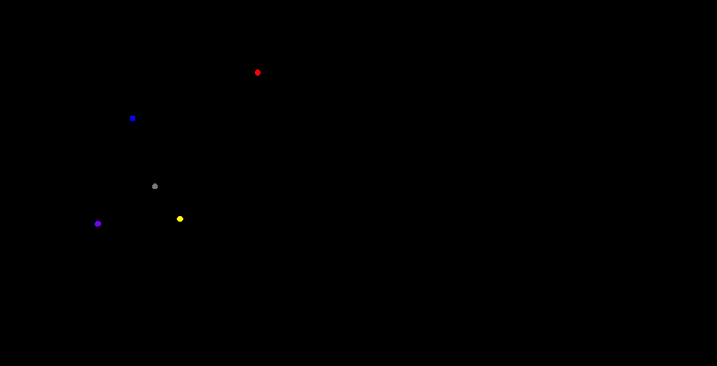
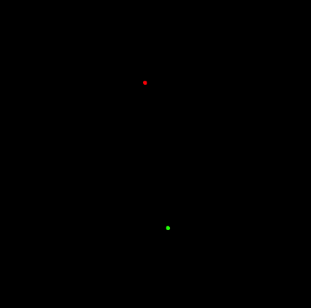
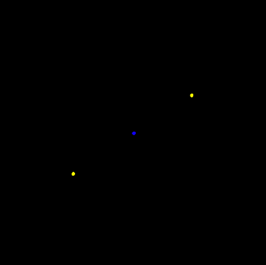

# Simulaciones de N-Cuerpos
Algoritmos y visualizaciones de sistemas dinámicos de cuerpos influenciados por la gravedad con modelos realistas de interacción galáctica escritos en Haskell.

* __Simulación Directa__ (Algoritmo O(n^2) donde la fuerza sobre cada partícula se calcula teniendo en cuenta cada otra partícula)
* __Simulación Barnes-Hut__ (Algoritmo O(n log n) basado en árboles cuádricos/octarios actualmente capaz de simular más de 50,000 cuerpos)
* __Modelos de Interacción Galáctica__ basados en muestreos Monte-Carlo de los modelos Plummer, Hemquist y Kuzmin. Esto nos permite generar condiciones iniciales realistas para galaxias esféricas y de disco para modelar interacciones y colisiones entre ellas.

---

### Modelos simulados con Barnes-Hut

_Galaxia esférica con modelo Plummer_

---


_Sistema Solar_

Sistema de Estrellas Binarias | Sistema de Tres Cuerpos
------------ | -------------
 | 

## Simulación Barnes-Hut
Barnes-Hut es un algoritmo eficiente de simulación de N-cuerpos que nos permite calcular la fuerza sobre un cuerpo particular en tiempo O(log n) en oposición al algoritmo de suma directa O(n).

Se basa en dividir recursivamente nuestro espacio en octantes en 3 dimensiones o cuadrantes en 2 dimensiones. Seguimos dividiendo los cuadrantes en más cuadrantes hasta que cada partícula ocupe su propio cuadrante. Todo esto manteniendo atributos invariantes sobre cada partición, como el centro de masa, la masa total y la posición.

Particionamiento del espacio | Particionamiento recursivo
---------------------- | --------------
 Imagen de Eclipse.sx de Wikimedia |  Imagen de Eclipse.sx de Wikimedia

Esto se logra utilizando una estructura de datos de árbol cuádrico/octario para almacenar los datos. Un Árbol de Barnes consiste en nodos internos y externos. Los cuerpos solo se almacenan en nodos externos. Un nodo externo del Árbol de Barnes puede contener como máximo 1 cuerpo.

```haskell
data BarnesTree = Exter !BarnesLeaf
                | Inter { cMass    :: !Pos
                        , btCenter :: !Pos
                        , width    :: !Float
                        , btMass   :: !Mass
                        , nw       :: !BarnesTree
                        , ne       :: !BarnesTree
                        , sw       :: !BarnesTree
                        , se       :: !BarnesTree
                        } deriving (Eq)

data BarnesLeaf = Leaf { blCenter :: !Pos
                       , blWidth  :: !Float
                       }
                | Node { bnCMass  :: !Pos
                       , bnCenter :: !Pos
                       , bnWidth  :: !Float
                       , blMass   :: !Mass
                       , body     :: !Body
                       } deriving (Show, Eq)
```
Comenzamos sub-dividiendo nuestro espacio en cuadrantes e insertando nuestros cuerpos en el Árbol de Barnes.
```haskell
insert :: Body -> BarnesTree -> BarnesTree
```
Hay 3 casos distintos que nuestra función `insert` debe abordar:
- _Caso 1:_ Insertar un cuerpo en un nodo Leaf externo sin cuerpos
    ```haskell
    insert b (Exter (Leaf c w)) = Exter (Node (pos b) c w (mass b) b)
    ```
- _Caso 2:_ Insertar un cuerpo en un nodo externo con un cuerpo
            Para hacerlo, reemplazamos el nodo externo con un nodo interno, actualizamos sus atributos e insertamos recursivamente el cuerpo en él
    ```haskell
    insert b1 (Exter (Node cMass c w m b2)) = insert b1 $ insert b2 $ interNode cMass c w m
    ```
- _Caso 3:_ Insertar un cuerpo en un Nodo interno - Actualización necesaria
            Para hacerlo, actualizamos los atributos necesarios, es decir, _centro de masa, masa total, etc._, encontramos en qué cuadrante pertenece el cuerpo e insertamos recursivamente el cuerpo en uno de los cuadrantes apropiados: `nw', ne', sw', se'`
    ```haskell
    insert b (Inter cMass c w m nw ne sw se) = Inter cMass' c w m' nw' ne' sw' se'
    ```
Ahora que nuestro espacio y los cuerpos en él han sido insertados efectivamente en el Árbol de Barnes, podemos utilizar su estructura para aproximar eficientemente, con una precisión arbitraria, la fuerza que experimenta cada partícula debido a todas las demás partículas.
```haskell
force :: Body -> BarnesTree -> Acc
```
Hay 3 casos distintos que los cálculos de fuerza deben tener en cuenta:
- _Caso 1:_ Si el BarnesTree es un nodo externo sin un cuerpo en él, no ejerce fuerza

    ```haskell
    force b (Exter (Leaf _ _)) = A 0 0
    ```
- _Caso 2:_ Si el BarnesTree es un nodo externo con un cuerpo en él, 
          calculamos la fuerza ejercida por el cuerpo que contiene

    ```haskell
    force b (Exter n)
      | b' /= b   = f b b'
      | otherwise = A 0 0
      where
        b' = body n
    ```
- _Caso 3:_ Si el BarnesTree es un nodo interno y su (ancho / distancia a la partícula desde el centro de masa) es menor que una cantidad configurable, `theta` (generalmente establecida en `0.5`), entonces simplemente podemos tratar todos los cuerpos en ese Árbol de Barnes como una masa puntual en el centro de masa del árbol mismo con una masa igual a la masa total del árbol. De lo contrario, calculamos recursivamente la fuerza ejercida sobre nuestro cuerpo, `b`, por cada uno de los cuadrantes.

    ```haskell
    force b (Inter cMass c w m q1 q2 q3 q4)
      | wd < theta = f b (B m cMass (V 0 0) G.red [])
      | otherwise  = foldr (vSum . force b) (A 0 0) [q1, q2, q3, q4]
    ```
    
## Cómo ejecutar
* Instalar dependencias
* Compilar y ejecutar, o alternativamente ejecutar `cabal run` o `stack build && stack exec`

## Por hacer
- [x] Galaxias esféricas y de disco realistas con modelos Plummer, Hernquist y Kuzmin para simular colisiones galácticas
- [ ] Visualización en 3D con el modelo Barnes-Hut de árbol octario
- [x] Paralelizar cálculos de fuerza
- [ ] Interfaz de usuario (GUI) expandida para seleccionar condiciones iniciales, cambiar constantes, agregar cuerpos, etc.
- [ ] Agregar manejo de colisiones
- [ ] Agregar un conjunto de pruebas integral
