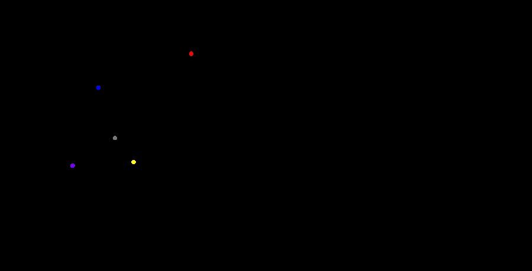
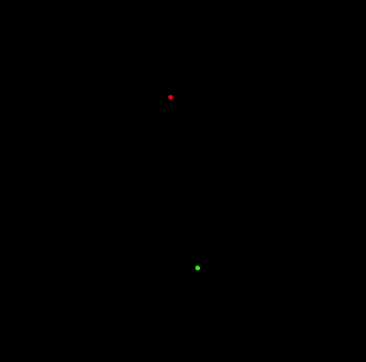
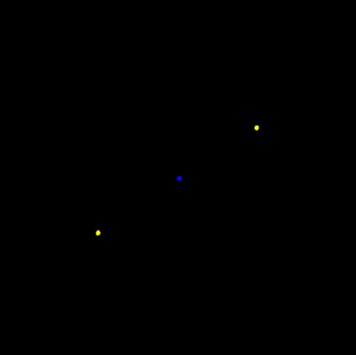

# N-Body Simulations
Algorithms and visualizations of dynamical systems of bodies influenced
by gravity with realistic galaxy interaction models written in Haskell.

* __Direct Simulation__ (O(n^2) algorithm where the force on each
particle is calculated by taking every other particle into account)
* __Barnes-Hut Simulation__ (O(n log n)) algorithm based on quad/oct trees currently capable of simulating over 50,000 bodies)
* __Galaxy Interaction Models__ based on Monte-Carlo samplings of
    the Plummer, Hemquist, and Kuzmin models. This enables us to
    generate realistic initial conditions for spherical and disk
    galaxies to model interactions and collisions between them.

---

### Models Simulated with Barnes-Hut

_Spherical Galaxy with Plummer Model_

---


_Solar System_

Binary Star System | Three Body System
------------ | -------------
 | 

## Barnes-Hut Simulation
Barnes-Hut is an efficient, N-body simulation algorithm
that allows us to calculate the force on a particular body in O(log n)
time as opposed to the O(n), direct-sum algorithm.

It relies on recursively dividing up our space into octants in 3 
dimensions or quadrants in 2 dimensions. We keep dividing quadrants into
further quadrants until each particle occupies it's own quadrant. All
the while maintaining invariant attributes about each partition like center 
of mass, total mass and position.

Partitioning the space | Recursive partitioning
---------------------- | --------------
 Image By Eclipse.sx from wikimedia |  Image by Eclipse.sx from wikimedia

This is accoomplished by using a quad/oct tree data-structure to store the
data. A Barnes Tree consists of internal and external nodes. Bodies are
only stored in external nodes. An external node of the Barnes Tree can
contain at most 1 body.

```haskell
data BarnesTree = Exter !BarnesLeaf
                | Inter { cMass    :: !Pos
                        , btCenter :: !Pos
                        , width    :: !Float
                        , btMass   :: !Mass
                        , nw       :: !BarnesTree
                        , ne       :: !BarnesTree
                        , sw       :: !BarnesTree
                        , se       :: !BarnesTree
                        } deriving (Eq)

data BarnesLeaf = Leaf { blCenter :: !Pos
                       , blWidth  :: !Float
                       }
                | Node { bnCMass  :: !Pos
                       , bnCenter :: !Pos
                       , bnWidth  :: !Float
                       , blMass   :: !Mass
                       , body     :: !Body
                       } deriving (Show, Eq)
```
We begin by sub-dividing our space into quadrants and inserting our
bodies into the Barnes Tree.
```haskell
insert :: Body -> BarnesTree -> BarnesTree
```
There are 3 distinct cases that our insert function has to address:
- _Case 1:_ Inserting a body into an external Leaf node with no bodies
    ```haskell
    insert b (Exter (Leaf c w)) = Exter (Node (pos b) c w (mass b) b)
    ```
- _Case 2:_ Inserting a body into an external node with a body
            To do this, we replace the external node with an internal
            node, update its attributes and recursively insert the body
            into it
    ```haskell
    insert b1 (Exter (Node cMass c w m b2)) = insert b1 $ insert b2 $ interNode cMass c w m
    ```
- _Case 3:_ Inserting a body into an internal Node - Update necessary
            To do this, we update the necessary attributes i.e. _center
            of mass, total mass etc._, find which quadrant the body
            belongs in and recursively insert the body into one of the
            appropriate quadrants: `nw', ne', sw', se'`
    ```haskell
    insert b (Inter cMass c w m nw ne sw se) = Inter cMass' c w m' nw' ne' sw' se'
    ```
Now that our space and the bodies in it have effectively been inserted
into the Barnes Tree, we can utilize its structure to efficiently
approximate, upto arbitrary precision, the force each particle experiences due
to all the other particles.
```haskell
force :: Body -> BarnesTree -> Acc
```
There are 3 distinct cases the force calculations have to take into
account:
- _Case 1:_ If the BarnesTree is an external node without a body in it, it
exerts no force

    ```haskell
    force b (Exter (Leaf _ _)) = A 0 0
    ```
- _Case 2:_ If the BarnesTree is an external node with a body in it, 
          we calculate the force exerted by the body in it

    ```haskell
    force b (Exter n)
      | b' /= b   = f b b'
      | otherwise = A 0 0
      where
        b' = body n
    ```
- _Case 3:_ If the BarnesTree is an internal node and its (width /
    distance to particle from center of mass) is less than a
    configurable quantity, `theta` (usually set to `0.5`), then we can
    simply treat all of the bodies in that Barnes Tree as a point mass
    at the center of mass of the tree itself with mass equal to the
    total mass of the tree. Otherwise, we recursively calculate the
    force exerted on our body, `b`, by each of the quadrants.

    ```haskell
    force b (Inter cMass c w m q1 q2 q3 q4)
      | wd < theta = f b (B m cMass (V 0 0) G.red [])
      | otherwise  = foldr (vSum . force b) (A 0 0) [q1, q2, q3, q4]
    ```
    
## How to Run
* Install dependencies
* Compile and launch, or alternatively run `cabal run` or `stack build
    && stack exec`

## To-Do
- [ ] Realistic spherical and disk galaxies with Plummer, Hernquist and
Kuzmin Models to simulate galaxy collisions
- [ ] 3D visualization with oct tree Barnes-Hut model
- [ ] Parallelize force calculations
- [ ] Expanded GUI for selecting initial conditions, changing constants,
adding bodies etc.
- [ ] Add collision handling
- [ ] Add comprehensive test suite
