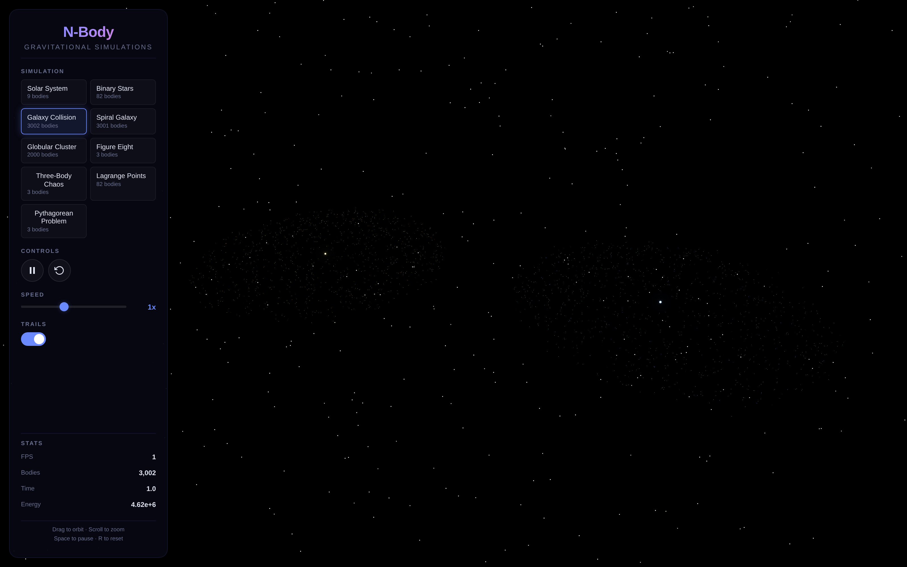
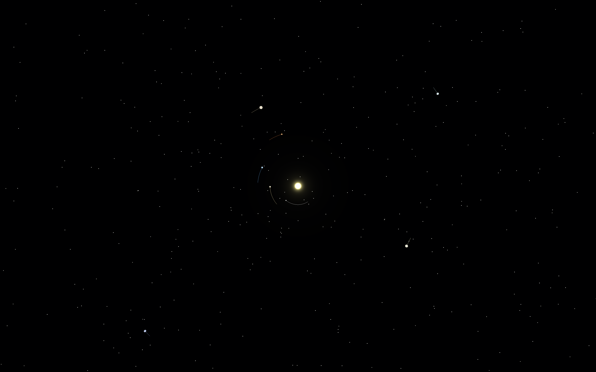
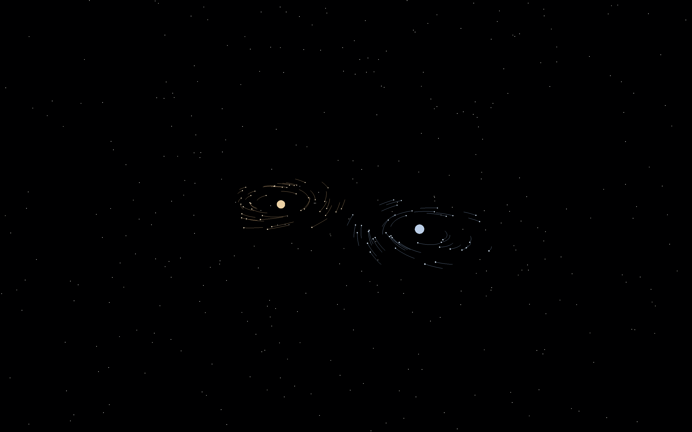
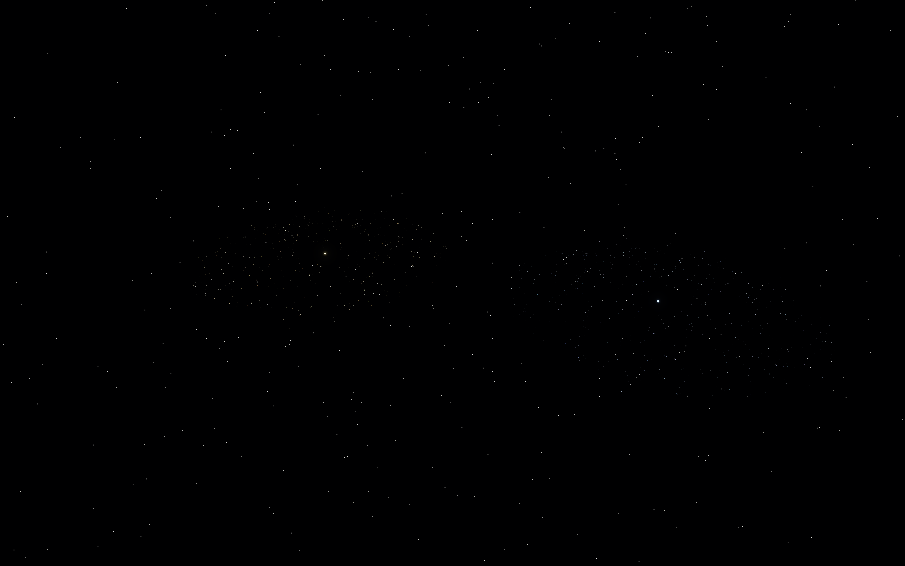
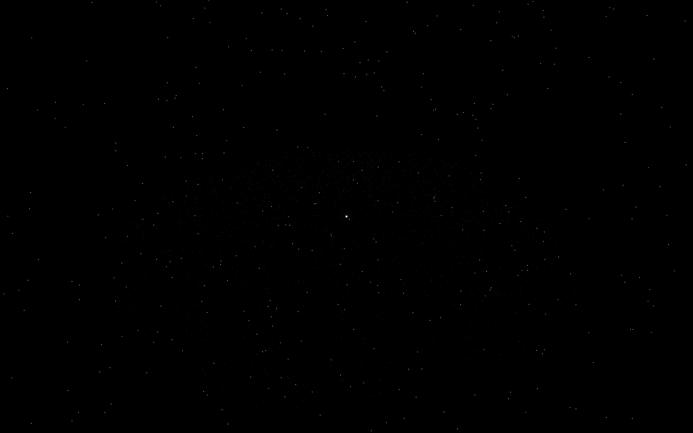
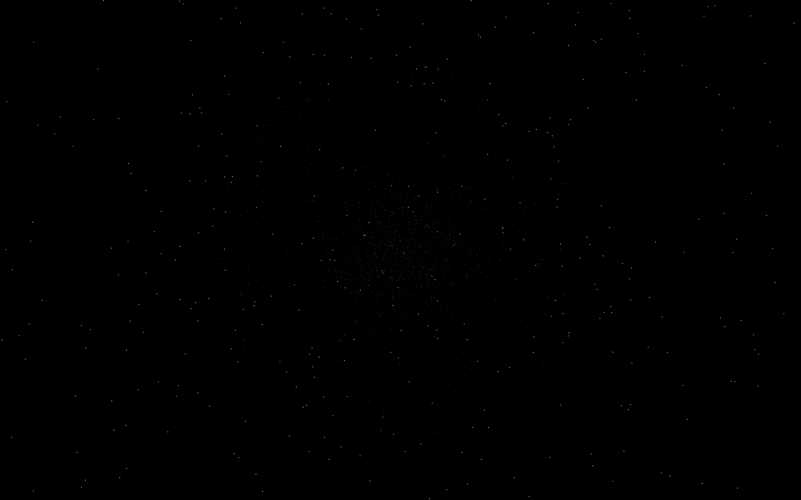
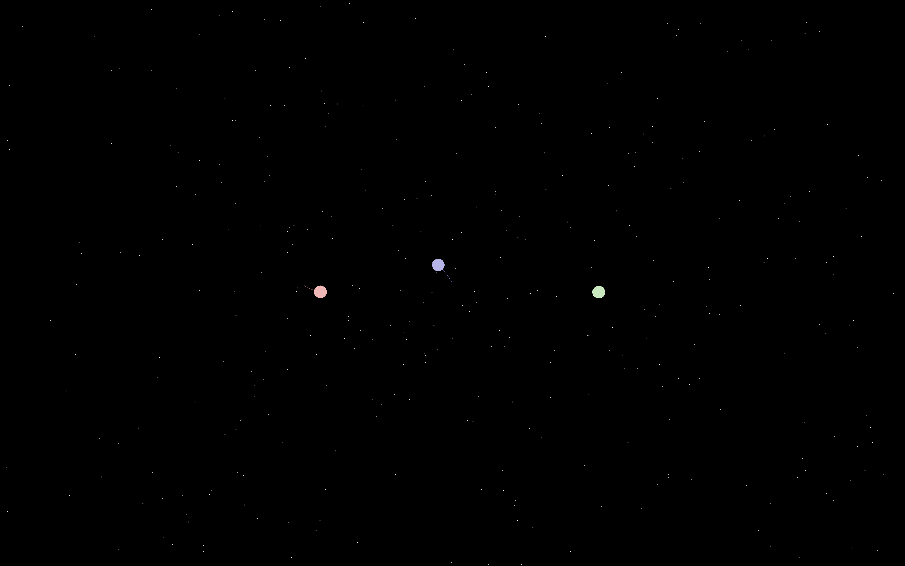
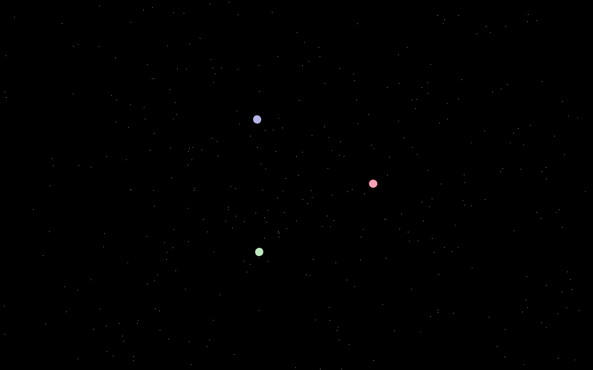
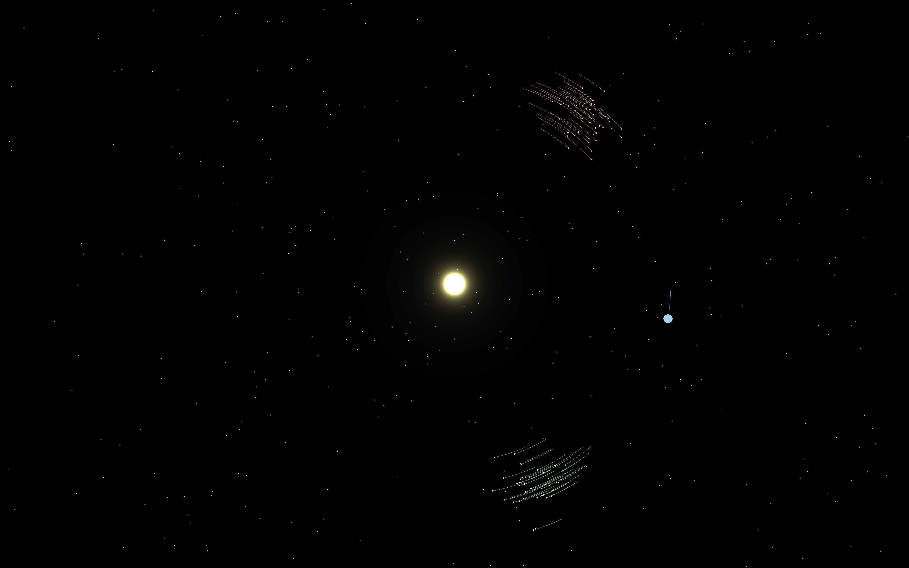
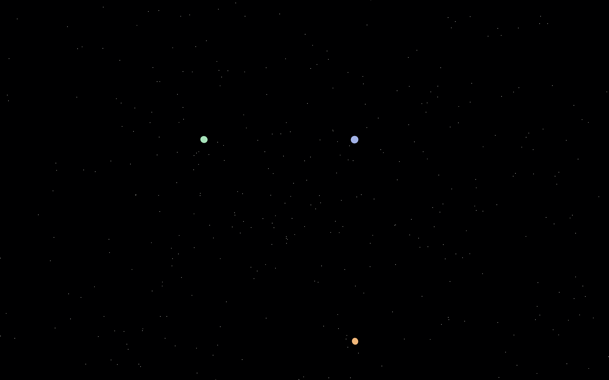

# N-Body Simulations

Beautiful real-time gravitational N-body simulations with two implementations:
a **modern web app** (Three.js + TypeScript) and **native Haskell** (Gloss).



### Demo Video

https://github.com/adityavkk/N-Body-Simulations/raw/claude/upgrade-and-modernize-gd6bM/images/demo.webm

## Web Application (`web-sim/`)

Interactive 3D simulation with a beautiful UI, 9 presets, and bloom effects.

```bash
cd web-sim
npm install
npm run dev
```

### Simulations

**Solar System** — 8 planets orbiting a central star with trails


**Binary Stars** — Two stars with debris disks orbiting their common center of mass


**Galaxy Collision** — 3,000 stars across two merging galaxies


**Spiral Galaxy** — 3,000-star disk galaxy with spiral arm formation


**Globular Cluster** — 2,000 stars with Plummer density profile


**Figure Eight** — Famous periodic three-body choreography


Three-Body Chaos | Lagrange Points | Pythagorean Problem
:-:|:-:|:-:
 |  | 

### Features

- **Barnes-Hut 3D octree** — O(n log n) force approximation, handles 3000+ bodies in real-time
- **Velocity Verlet integration** — symplectic integrator for energy conservation
- **Three.js** with Unreal Bloom post-processing and additive particle blending
- **Glassmorphism UI** with speed slider, trail toggle, real-time stats (FPS, energy, body count)
- **Keyboard shortcuts** — Space to pause, R to reset
- **Mouse controls** — drag to orbit, scroll to zoom

**Tech:** Vite 8 · TypeScript 6 · Three.js 0.183

---

## Haskell: Barnes-Hut Simulation (`Barnes-Hut/`)

O(n log n) quadtree-based simulation capable of 50,000+ bodies.

```bash
cd Barnes-Hut
stack build && stack exec Barnes-Hut-Exe
# or: cabal run Barnes-Hut-Exe
```

**Keyboard Controls:**

| Key | Action |
|-----|--------|
| `p` | Pause/resume |
| `t` | Toggle trails |
| `=` / `-` | Zoom in / out |
| `f` / `s` | Faster / slower |
| `1`-`6` | Switch preset (binary stars, 3-body, 4-body, solar system, random galaxy, figure-8) |

**Run tests:**
```bash
cd Barnes-Hut && stack test
```

**Tech:** GHC 9.8 (LTS 22.43) · Gloss 1.13 · QuickCheck

---

## Haskell: Direct Simulation (`Direct-Simulation/`)

O(n²) brute-force simulation — useful for small systems and as a reference.

```bash
cd Direct-Simulation
stack build && stack exec Direct-Simulation
# or: cabal run Direct-Simulation
```

**Tech:** GHC 9.8 (LTS 22.43) · Gloss 1.13

---

## How It Works

### Barnes-Hut Algorithm

The Barnes-Hut algorithm recursively divides space into quadrants (2D) or octants (3D). Each node stores the center of mass and total mass of all bodies within it. For force calculation:

1. If the node is far enough away (width/distance < theta), treat the entire cluster as a single point mass
2. Otherwise, recurse into the children

This reduces force calculation from O(n) to O(log n) per body.

### Velocity Verlet Integration (Web)

The web version uses the Velocity Verlet (leapfrog) integrator which is symplectic — it conserves energy over long timescales, unlike Euler integration.

### Galaxy Models

Galaxy initial conditions use Monte Carlo sampling of astrophysical density profiles:
- **Plummer model** — spherical galaxies
- **Hernquist model** — steeper core profile
- **Kuzmin model** — disk galaxies

---

## Architecture

```
N-Body-Simulations/
├── web-sim/                    # Modern web application
│   ├── src/engine/             #   Physics (octree, Verlet integrator)
│   ├── src/presets/            #   9 simulation presets
│   ├── src/renderer/           #   Three.js + bloom post-processing
│   └── src/ui/                 #   Controls panel
├── Barnes-Hut/                 # Haskell Barnes-Hut (O(n log n))
│   ├── src/                    #   BarnesHut, Gravity, Bodies, GalaxyModels
│   └── test/                   #   HSpec + QuickCheck test suite
└── Direct-Simulation/          # Haskell direct-sum (O(n²))
    └── src/                    #   Main, Gravity, SolarSystem
```

## License

BSD-3-Clause
